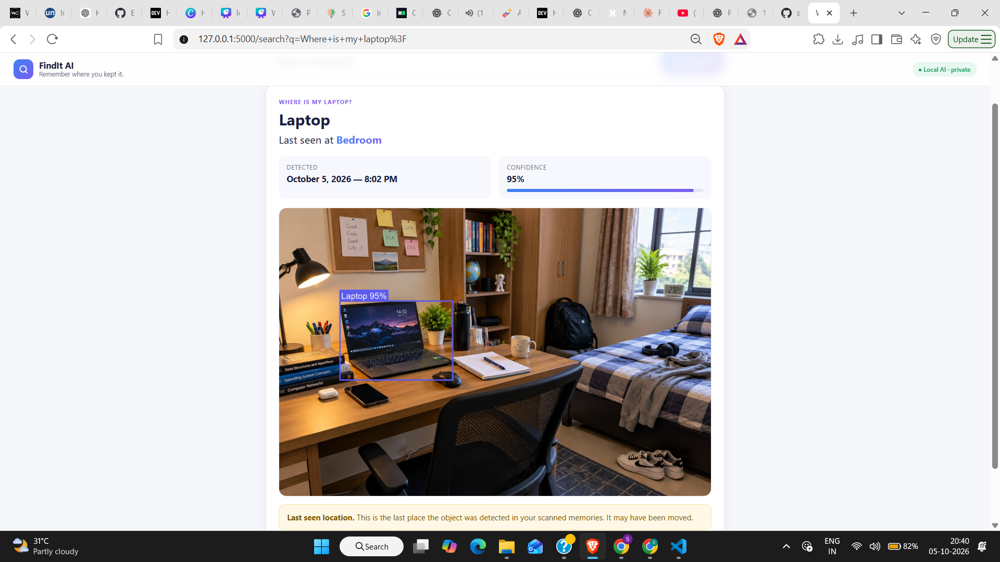

# FindIt AI

> **Remember where you kept it.**
## Demo



FindIt AI is a local visual-memory assistant that uses open-source object detection to remember where everyday objects were **last seen** in scanned spaces.


## The problem

People often remember having an everyday item but forget where they last saw it. A normal text search cannot answer a visual question such as **"Where is my laptop?"**.

## The idea

1. Take a photo of a desk, room, backpack, cupboard, or other space.
2. Choose a simple location label such as **Study Desk**.
3. FindIt AI runs a local object detector and stores the detections in SQLite.
4. Later, ask **"Where is my laptop?"**.
5. FindIt AI returns the latest recorded sighting, confidence, timestamp, and an evidence image with the object highlighted.

> **Important:** FindIt AI reports a *last-seen memory*. It is not real-time tracking, and an object may have moved after the scan.

## Why open/local AI?

Room and desk photos can contain personal information. FindIt AI is designed so the object-detection step can run on the user's own computer without a proprietary AI API or per-image cloud inference.

Open models also make the system easier to inspect, adapt, replace, and fine-tune later.

The default model weights are downloaded on first use unless they are already present locally. After the model is available, the application does not upload scanned photos to a third-party AI API.

## Features

- Local object detection with Ultralytics YOLO
- SQLite visual memory
- Last-seen location and timestamp
- Confidence scores and bounding boxes
- Evidence images for search results
- Natural-language-style object queries
- Multiple scans with latest-sighting retrieval
- Upload validation and friendly error handling
- Local health/diagnostic endpoint
- Lightweight responsive web interface

## Architecture

```text
User
  ↓
FindIt AI Web UI
  ↓
Flask Backend
  ↓
Local YOLO Object Detection
  ↓
Object + Bounding Box + Confidence
  ↓
SQLite Visual Memory
  ↓
Natural-Language Object Search
  ↓
Latest Last-Seen Result
  ↓
Evidence Image
```

## Tech stack

| Layer | Technology |
|---|---|
| Frontend | HTML, CSS, Vanilla JavaScript |
| Backend | Python, Flask |
| AI | Ultralytics YOLO |
| Database | SQLite |
| Image processing | Pillow |
| Computer vision | OpenCV |

## Supported objects

The default configuration uses **YOLOv8s trained on COCO**. It supports the model's COCO classes, including common objects such as:

- laptop
- cell phone (shown as Phone)
- keyboard
- mouse
- bottle
- backpack
- book
- cup
- clock
- remote
- scissors

The application does **not** fake unsupported detections. For example, a standard COCO model does not include classes such as calculator, wallet, charger, or keys.

An optional YOLO-World configuration is present for open-vocabulary experimentation. Treat it as experimental and validate it on your own hardware/data before relying on it for a demo.

## Screens / demo flow

A strong demo is:

```text
Scan a desk photo
       ↓
Choose: Study Desk
       ↓
AI detects Laptop, Phone, Mouse, etc.
       ↓
Search: "Where is my laptop?"
       ↓
"Last seen at Study Desk"
       ↓
Evidence image with Laptop highlighted
```

For a multi-location demo, scan another image as **Bedroom**, then search for the same object and verify that the newest scan is returned.

## Installation — Windows

Python 3.10–3.12 is recommended.

```powershell
python -m venv venv
.\venv\Scripts\Activate.ps1
python -m pip install --upgrade pip
pip install -r requirements.txt
```

If you have a compatible NVIDIA setup, install a matching PyTorch CUDA build according to the current PyTorch installation instructions before installing the remaining dependencies.

## Run

```powershell
python app.py
```

Open:

```text
http://127.0.0.1:5000
```

Health check:

```text
http://127.0.0.1:5000/health
```

The first model load may take longer because the weights may need to be downloaded.

## Testing

Run:

```powershell
pytest
```

The included tests cover core query parsing and SQLite memory behaviour without requiring model inference.

## Project structure

```text
FindIt-AI/
├── app.py
├── database.py
├── detector.py
├── search.py
├── requirements.txt
├── README.md
├── LICENSE
├── CONTRIBUTING.md
├── SECURITY.md
├── CODE_OF_CONDUCT.md
├── tests/
│   ├── test_database.py
│   └── test_search.py
├── templates/
├── static/
├── data/
├── uploads/
└── processed/
```

Runtime data such as the SQLite database, uploaded photos, processed images, model weights, and virtual environments are excluded from version control.

## Privacy notes

FindIt AI is intended as a local-first prototype. Scanned images are processed by the local application and are not intentionally uploaded to a third-party AI API.

Do not commit personal photos, generated evidence images, database files, API keys, or other private data to a public repository.

## Limitations

- An object must be visible in a scan to be remembered.
- The object may move after the scan.
- The default detector only recognises its supported model classes.
- Small or heavily occluded objects can be missed.
- Detection quality depends on image quality, lighting, viewpoint, and model choice.
- This is not real-time object tracking.

## Future scope

- Open-vocabulary object detection
- Object re-identification
- Video scanning and temporal tracking
- Voice search
- OCR for labels and text
- Automatic room/location recognition
- Personalised fine-tuning
- Mobile/on-device deployment

## Contributing

See [CONTRIBUTING.md](CONTRIBUTING.md).

## Security

See [SECURITY.md](SECURITY.md).

## License and third-party software

FindIt AI is released under the **GNU Affero General Public License v3.0**. See [LICENSE](LICENSE).

The project also uses third-party software and model weights with their own licenses. In particular, review the applicable **Ultralytics** licensing terms before using or distributing the project for commercial purposes.
